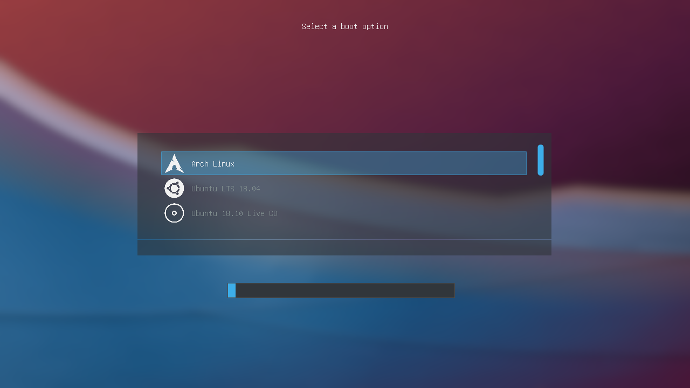
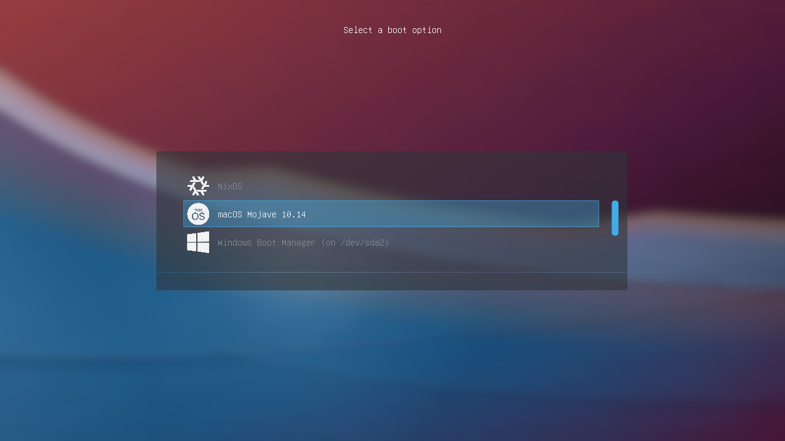
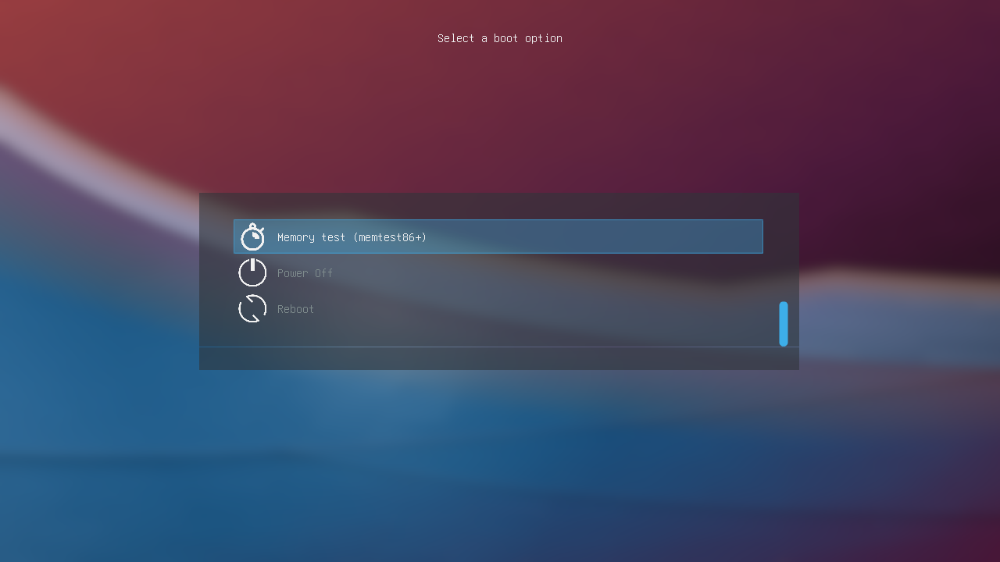

# Breeze
A minimalistic GRUB theme inspired by Breeze.

> Keep in mind that the previous screenshots were taken on a low-resolution QEMU virtual machine.

## Installation
Copy the "breeze" folder to the themes directory in /boot. If you don't know how to do it, just run the included "install.sh" script as root.
